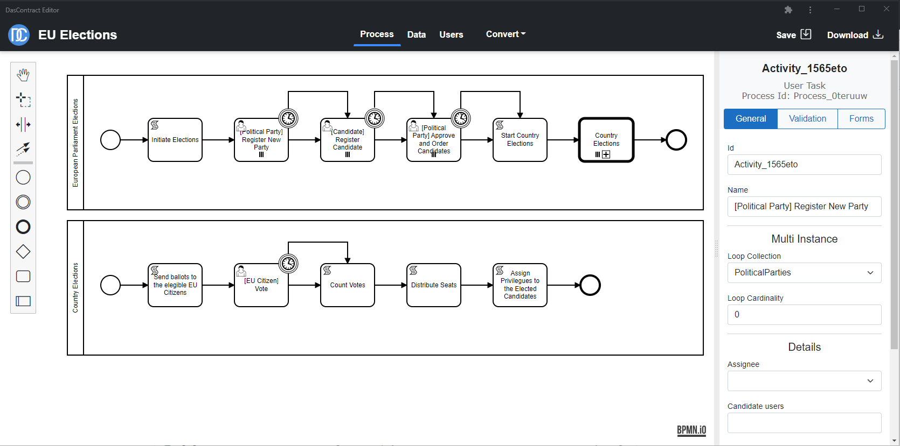

# DasContract
A visual language allowing to define blockchain smart contracts between people. It is based on the extended combination of DEMO modeling language, BPMN and UML.

## Getting started
We recommend to first read our [article](https://janklicpera.medium.com/a-novel-way-of-conducting-legal-contracts-be54ceda39ad) published on Medium, which summarizes the underlying technology and showcases DasContract on a case study.

## Supported BPMN elements
The modelling part of DasContract is mainly an extension of the [BPMN](https://camunda.com/bpmn). The capabilities of the language are mostly demonstrated in the provided case studies. The following BPMN elements are supported in DasContract v2.0:

- user tasks, business tasks and script tasks
- call activities and subprocesses
- multi instance task types
- exclusive and parallel gateways
- start and end events
- timer boundary events

## Editor
The editor provides a simple, user-friendly interface to create DasContract diagrams, which can be then converted into smart contract code on for a desired platform. An experimental build of the editor can be accessed at https://black-plant-0fbebdc03.azurestaticapps.net/.
A user manual for using the editor can be found at https://youtu.be/aNEGOOlsviI.
The current editor supports DasContract v2.0, legacy version of the editor that supports v1.0 can be found in a separate [repository](https://github.com/drozdik-m/das-contract-editor)

### Used technologies
The editor is built using [Blazor WebAssembly](https://docs.microsoft.com/en-us/aspnet/core/blazor/host-and-deploy/webassembly). It runs entirely in the browser, so no backend server is required and
the app can be served as static pages. It also utilizes PWA technologies on [supported browsers](https://caniuse.com/?search=PWA), meaning it is installable as a standalone application 
and can be run fully offline.

### Local deployment and development
The source code for the web editor is located in the project DasContract.Editor.Web.
To run the project locally:
1. Navigate to DasContract/Dascontract.Editor.Web/wwwroot
2. Run `npm install` to install all node dependencies
3. Run `npm run build` to run a build script (packs all js files and copies dependencies into the dist folder)
4. Set DasContract.Editor.Web as the startup project and run it.

### Running E2E tests
The E2E tests require an address of the running application to test. The application may be launched locally and then tested. 
The address can be defined in appsettings.json, inside of the E2E testing project. 

## Solidity Converter
The converter allows to automatically transform .dascontract files created using the editor into [Solidity smart contract language](https://docs.soliditylang.org/en/v0.7.4/), which can be then deployed onto the Ethereum blockchain. It supports the conversion of DasContract v2.0, an example of a conversion can be found in DasContract.CaseStudies/elections.

### Locally deploying the converted code
A number of tools exist, which allow to deploy the Solidity code onto a local testing blockchain.

The easiest way to test the code is the [Remix editor](https://remix.ethereum.org/), which provides a Solidity compiler and contract deployment directly in the browser. It also provides a simple interface, allowing the user to directly interact with the deployed blockchain.

Another tool that can be used is [Ganache](https://www.trufflesuite.com/ganache), which allows to create an Ethereum blockchain on the local machine and provides an interface to interact with the blockchain. Whilst being more complicated to setup, it allows to develop and test more complex applications alongside the blockchain.

## Case Studies
This repository contains two exemplar case studies, one for each version of the DasContract language. The diagrams and the converted code can be found in the DasContract.CaseStudies folder.

### Mortgage Case Study
[Video walkthrough](https://www.youtube.com/watch?v=Z3dTFiMwZTU)

## Published research articles
- [Exploring a Role of Blockchain Smart Contracts in Enterprise Engineering](https://link.springer.com/chapter/10.1007/978-3-030-06097-8_7) (2018)
- [Das Contract – A Visual Domain Specific Language for Modeling Blockchain Smart Contracts](https://link.springer.com/chapter/10.1007/978-3-030-37933-9_10) (2020)
- [Towards Model-Driven Smart Contract Systems – Code Generation and Improving Expressivity of Smart Contract Modeling](http://ceur-ws.org/Vol-2825/paper1.pdf) (2021)

## Further research
DasContract is being actively developed, the current planned features are:
- A new DasContract editor that supports DasContract 2.0.
- Support for the Cardano smart contract platform.

## Authors
This project is created as part of Marek Skotnica's PhD thesis and research. 

Contributors: Jan Frait, Jan Klicpera, Martin Drozdík, and Ondřej Šelder.
