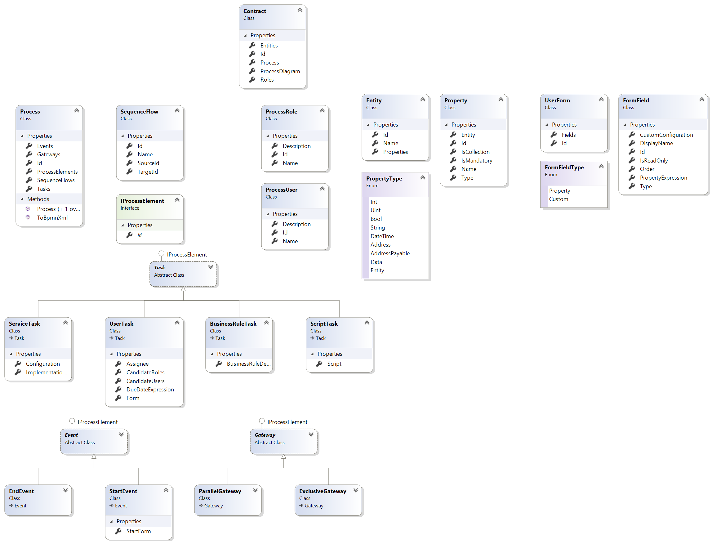

# Das Contract Specification 

## Introduction 
The Das Contract consists of four models: 
- Process model 
- Data model 
- Froms model
- Actions model 

## Meta Model

## Models

### Process Model
The following BPMN concepts are supported: 
- Activities: User, Script, Business Rule, Payment (Das Contract specific), Call Activity, Multi instance (Parallel, Sequential) 
- Gateways: Exclusive, Parallel
- Events: Interupting boundary timer event. 

